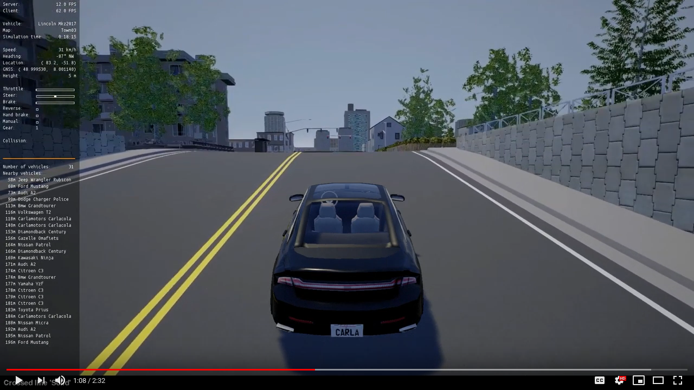

[](https://opensource.org/licenses/MIT)

[](https://travis-ci.com/carla/scenario_runner)


ScenarioRunner for CARLA
========================
This repository contains traffic scenario definition and an execution engine
for CARLA. It also allows the execution of a simulation of the CARLA Challenge.
You can use this system to prepare your agent for the CARLA Challenge.

Scenarios can be defined through a Python interface, and with the newest version
the scenario_runner also the upcoming [OpenScenario](http://www.openscenario.org/) standard is supported.

[](https://youtu.be/ChmF8IFagpo?t=68)


Getting the ScenarioRunner
---------------------------

Use `git clone` or download the project from this page. Note that the master
branch contains the latest fixes and features, and may be required to use the latest features from CARLA.

It is important to also consider the release version that has to match the CARLA version.

* Version 0.9.6: Compatible with [CARLA 0.9.6](https://github.com/carla-simulator/carla/releases/tag/0.9.6)
* [Version 0.9.5](https://github.com/carla-simulator/scenario_runner/releases/tag/v0.9.5) and [Version 0.9.5.1](https://github.com/carla-simulator/scenario_runner/releases/tag/v0.9.5.1): Compatible with [CARLA 0.9.5](https://github.com/carla-simulator/carla/releases/tag/0.9.5)
* [Version 0.9.2](https://github.com/carla-simulator/scenario_runner/releases/tag/0.9.2): Compatible with [CARLA 0.9.2](https://github.com/carla-simulator/carla/releases/tag/0.9.2)

To use a particular version you can either download the corresponding tarball or simply checkout the version tag associated to the release (e.g. git checkout v0.9.5)

Currently no build is required, as all code is in Python.


Using the ScenarioRunner
------------------------

Please take a look at our [Getting started](Docs/getting_started.md)
documentation.

Challenge Evaluation
---------------------

You can evaluate your own agents using a reproduction
of the CARLA Challenge by following [this tutorial](Docs/challenge_evaluation.md)


Contributing
------------

Please take a look at our [Contribution guidelines][contriblink].

[contriblink]: http://carla.readthedocs.io/en/latest/CONTRIBUTING


F.A.Q.
------

If you run into problems, check our
[FAQ](http://carla.readthedocs.io/en/latest/faq/).


License
-------

ScenarioRunner specific code is distributed under MIT License.


Customize ScenarioRunner for MPSC
==================================

Requirement (Installation)
--------------------------
1. Install UnrealEngine4.22 and Latest CARLA following [How to build CARLA on Linux]. <br/>
Note: 
  * clone `master` branch instead of `stable` branch to aviod "No rule to build target 'launch'" error. (Two branches have totally different Makefile)
  * They just updated the Releases to 0.9.6, but I am using 0.9.5.
2. Clone this repo and follow [Getting started](Docs/getting_started.md) documentation.
3. Python3.5

## NN_controller

Run the code in scenario_runner setting
------------
1. After [building] and [Getting started](Docs/getting_started.md) and some configurations, my `~/.bashrc` looks like the followings:
```
# >>> for CARLA >>>
# start UE as CARLA's server
export UE4_ROOT=~/UnrealEngine_4.22
 
export CARLA_ROOT=/home/ruihan/UnrealEngine_4.22/carla/
export PYTHONPATH=${CARLA_ROOT}/PythonAPI/carla:$PYTHONPATH

export CARLA_SERVER_DIR=/home/ruihan/UnrealEngine_4.22/carla/Unreal/CarlaUE4/Saved/StagedBuilds/LinuxNoEditor
# export CARLA_SERVER=/home/ruihan/UnrealEngine_4.22/carla/Unreal/CarlaUE4/Saved/StagedBuilds/LinuxNoEditor/CarlaUE4.sh

# for conditional imitation learning
export PYTHONPATH=/home/ruihan/coiltraine:$PYTHONPATH

# for CARLA AD Challenge, scenario_runner
export ROOT_SCENARIO_RUNNER=/home/ruihan/scenario_runner
export PYTHONPATH=$PYTHONPATH:${CARLA_ROOT}/PythonAPI/carla/dist/carla-0.9.5-py3.5-linux-x86_64.egg:${CARLA_ROOT}/PythonAPI/carla/agents:${CARLA_ROOT}/PythonAPI/carla
export PYTHONPATH=$PYTHONPATH:${CARLA_ROOT}/PythonAPI/carla/:${ROOT_SCENARIO_RUNNER}:${CARLA_ROOT}/PythonAPI/carla/dist/carla-0.9.5-py2.7-linux-x86_64.egg:${CARLA_ROOT}/PythonAPI/carla/agents
```
(`coiltraine` environment is not necessary if all other required packages are installed)

2. Run the commands
* To collect data from `manual_control.py`, press `P` on keyboard to enable `autopilot` <br/>
modify ~L265 (about line 265) `def write_in_csv(location, waypoint_tf, lane_width, control, ds='localization_relative_coords_ds.csv')` to change dataset filename. <br/>
*Add `record_dataset` and `write_in_csv` methods to original `manual_control.py`*

```
ruihan@depend-XPS-8930:cd $CARLA_SERVER_DIR
ruihan@depend-XPS-8930:~/UnrealEngine_4.22/carla/Unreal/CarlaUE4/Saved/StagedBuilds/LinuxNoEditor$ ./CarlaUE4.sh
(coiltraine) ruihan@depend-XPS-8930:~/scenario_runner$ python scenario_runner.py --scenario BackgroundActivity_1 --reloadWorld
(coiltraine) ruihan@depend-XPS-8930:~/scenario_runner$ python manual_control_record.py 
```
* To train the NN_controller
`ruihan@depend-XPS-8930:~/scenario_runner$ python NN_controller.py` <br/>
modify ~L58 `ds_file = 'localization_relative_coords_ds.csv'` (input dataset) and ~L158 `torch.save(model, 'models/NN_model_relative_epo50.pth')` (output model)
* To test the NN_controller, press `N` on keyboard to enable NN_controller <br/>
*Add `get_nn_controller` method to `manual_control_record.py`*

```
ruihan@depend-XPS-8930:~/UnrealEngine_4.22/carla/Unreal/CarlaUE4/Saved/StagedBuilds/LinuxNoEditor$ ./CarlaUE4.sh
(coiltraine) ruihan@depend-XPS-8930:~/scenario_runner$ python scenario_runner.py --scenario BackgroundActivity_1 --reloadWorld
(coiltraine) ruihan@depend-XPS-8930:~/scenario_runner$ python manual_control_test_NN.py 
```
Modify ~L118 `   def __init__(self, carla_world, hud, nn_model_path='models/NN_model_epo50.pth'):` to change the path of the model to be tested.

* To see the performance of CoIL 
```
ruihan@depend-XPS-8930:~/UnrealEngine_4.22/carla/Unreal/CarlaUE4/Saved/StagedBuilds/LinuxNoEditor$ ./CarlaUE4.sh -benchmark -fps=20 -quality-level=Epic
(coiltraine) ruihan@depend-XPS-8930:~/scenario_runner$ bash srunner/challenge/run_evaluator_co.sh
```

Run the code in CARLA AD Challenge setting
------------------------------
1. 
```
ruihan@depend-XPS-8930:~/UnrealEngine_4.22/carla/Unreal/CarlaUE4/Saved/StagedBuilds/LinuxNoEditor$ ./CarlaUE4.sh -benchmark -fps=20 -quality-level=Epic
(coiltraine) ruihan@depend-XPS-8930:~/scenario_runner$ bash srunner/challenge/run_evaluator_NN.sh
```

## e2c_controller

Run the code 
------------------------------
1. Collect data in senario_runner setting
```
ruihan@depend-XPS-8930:~/UnrealEngine_4.22/carla/Unreal/CarlaUE4/Saved/StagedBuilds/LinuxNoEditor$ ./CarlaUE4.sh
(coiltraine) ruihan@depend-XPS-8930:~/scenario_runner$ python scenario_runner.py --scenario BackgroundActivity_1 --reloadWorld
(coiltraine) ruihan@depend-XPS-8930:~/scenario_runner$ python manual_control_record_e2c.py 
```
collected data (image .png and control .npy) are saved in `/data` folder but are not uploaded to remote repo
2. Parse data and train the model `(coiltraine) ruihan@depend-XPS-8930:~/scenario_runner$ python e2c_controller.py` **OR** `e2c_controller_cat.py` (which concatenate measurement to latent vector), which load the `/data/processed.pkl` file as data source. 
3. Note: modify `save_dir` in `manual_control_record_e2c.py`, `ds_dir` and `model_path` in `e2c_controller_cat.py`, corespondingly.


